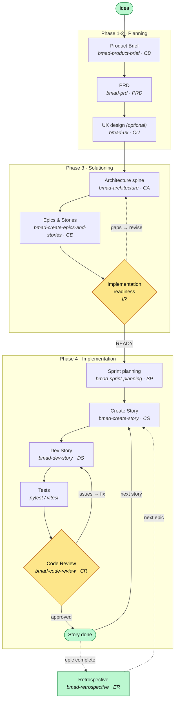

# BMAD Lifecycle

The phase-based flow this project follows, from planning through the per-story build cycle.
Each node names the **BMAD skill** (menu code) that drives it.

## The spine in words

| Step | Skill | Produces |
|------|-------|----------|
| **Planning** | `bmad-product-brief` → `bmad-prd` (+ optional `bmad-ux`) | brief → PRD (FRs/NFRs) |
| **Architecture** | `bmad-architecture` | the invariant "spine" (ADs) all code obeys |
| **Story** | `bmad-create-epics-and-stories` → `bmad-create-story` | epics → context-rich story files |
| **Dev** | `bmad-dev-story` | working code (red → green → refactor) |
| **Test** | pytest / vitest (inside dev-story) | passing unit/integration tests |
| **Review** | `bmad-code-review` | adversarial findings → patch / defer / dismiss |

## Key loops

- **Story cycle** — `Create Story → Dev → Test → Review` repeats once per story; Review sends work back to Dev on issues, or forward to *done*, then pulls the next story.
- **Readiness gate** — before any code, `IR` confirms PRD ↔ Architecture ↔ Stories align; gaps loop back to revise the plan.
- **Per-epic retrospective** — optional at each epic's end, feeding lessons into the next epic.

> Status of each story is tracked in `_bmad-output/implementation-artifacts/sprint-status.yaml`
> (`backlog → ready-for-dev → in-progress → review → done`).
