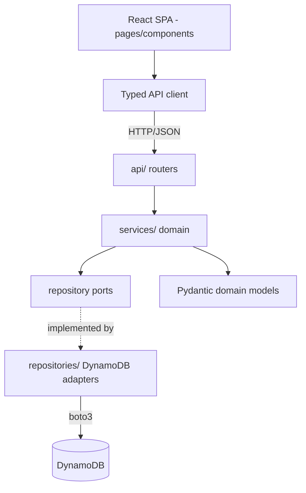
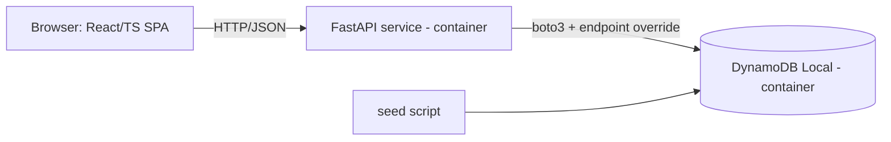
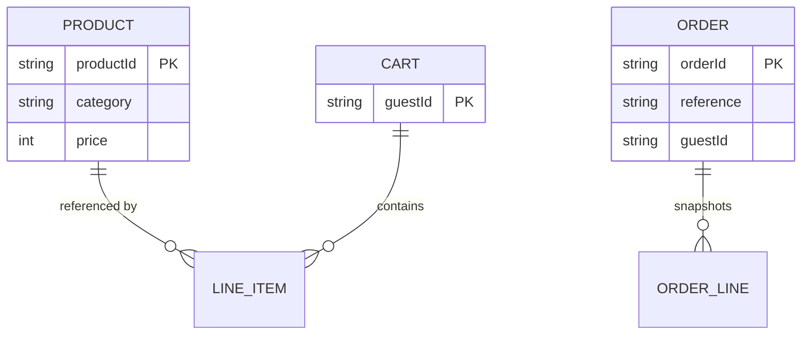

# Architecture Spine — bmad-ecommerce

## Design Paradigm

**Client-server SPA over a REST API, with a Ports-and-Adapters (hexagonal-lite) backend.**

- **Frontend** — a React/TypeScript single-page app. Pages compose components; all server access goes through one typed API-client module. No component talks to the network directly.
- **Backend** — three layers, dependencies point inward only:
  - `api/` (HTTP routers) — translate requests/responses; no business logic.
  - `services/` (domain) — the rules; depend on repository **ports** (interfaces), never on boto3.
  - `repositories/` (adapters) — the only place DynamoDB/boto3 is touched.
- **Data store** — DynamoDB (local-first via `amazon/dynamodb-local`; same SDK calls as AWS).

## Invariants & Rules

### AD-1 — Ports-and-Adapters backend layering `[ADOPTED]`
- **Binds:** all backend FRs
- **Prevents:** business logic leaking into HTTP handlers; boto3/DynamoDB calls scattered across the codebase
- **Rule:** dependency flow is `api → services → repository ports`. DynamoDB/boto3 appears **only** inside `repositories/` adapters. Domain models are plain Pydantic types; no DynamoDB item shapes surface above the repository layer.

### AD-2 — Anonymous identity via opaque guest token
- **Binds:** FR-7, FR-8, FR-9, FR-10, FR-11, FR-14
- **Prevents:** two components inventing different session mechanisms; any drift toward accounts/PII
- **Rule:** the API issues an opaque `guestId` (UUID) on first cart interaction; the client stores it (localStorage) and sends it on every cart/order request via the `X-Guest-Token` header. Carts and Orders are keyed by `guestId`. No login, no user records, no other identity.

### AD-3 — One aggregate, one table, one owner
- **Binds:** all persistence (FR-7..FR-16)
- **Prevents:** two owners of one entity; clashing key schemas
- **Rule:** separate DynamoDB tables per aggregate — **Products**, **Carts**, **Orders** — each accessed through exactly one repository. No cross-repository raw table access. (Single-table design is a deliberately deferred alternative — see Deferred.)

### AD-4 — Catalog query strategy: DynamoDB GSIs + post-filter `[ADOPTED]`
- **Binds:** FR-1 (browse), FR-2 (search), FR-3 (category facet), FR-4 (sort)
- **Prevents:** ad-hoc inconsistent query paths, unbounded scans, divergent pagination
- **Rule:**
  - **Products** table: `PK = productId`.
  - `gsi_category` (`PK = category`, `SK = price`) → serves the **category facet** + **price sort** + pagination.
  - `gsi_listing` (`PK = "PRODUCT"` constant, `SK = price`) → serves the **unfiltered listing** + price sort + pagination.
  - **Free-text search (FR-2)** is a DynamoDB `FilterExpression` (`contains` on name/description) layered on the Query — accepted as sufficient at POC scale (hundreds of products). DynamoDB has no native full-text; a search engine is **deferred** (see Deferred).
  - **Pagination** uses DynamoDB `LastEvaluatedKey`, surfaced to the client as an opaque base64 cursor (never raw keys).
- **Alternative considered (Option B):** load the small catalog into an in-process read cache and do search/facet/sort/paginate in memory (DynamoDB stays system-of-record + seed target). Simpler and exact, but sidesteps the DynamoDB-query learning goal. **Chosen A** (user-confirmed) to exercise real access patterns.

### AD-5 — API contract & wire conventions `[ADOPTED]`
- **Binds:** all FRs (the frontend↔backend boundary)
- **Prevents:** the two sides diverging on shapes, errors, or pagination
- **Rule:** REST/JSON over HTTP; resource-oriented paths. FastAPI's generated **OpenAPI is the source of truth**; the frontend consumes a typed client derived from it. Error envelope is `{ "error": { "code", "message" } }`. JSON is camelCase. Pagination is an opaque cursor. CORS origins come from config.

### AD-6 — Money as integer minor units `[ADOPTED]`
- **Binds:** FR-11, FR-14, FR-15
- **Prevents:** floating-point rounding drift; divergent total math
- **Rule:** all monetary values are **integer minor units** (cents) in a single currency. `Subtotal = Σ(unitPrice × qty)`; `OrderTotal = Subtotal + flatShipping` (a config constant); **no tax**. Formatting to a display string happens only in the frontend.

### AD-7 — Orders are immutable; checkout is atomic
- **Binds:** FR-14, FR-15
- **Prevents:** multiple mutation paths on orders; a cart that survives a placed order
- **Rule:** placing an order writes an **immutable Order** — a snapshot of line items (with unit prices at time of purchase), totals, shipping details, a reference number, and a UTC timestamp — and **clears the Cart** as one logical operation. Orders are never updated after creation. The Order Summary renders the persisted Order verbatim.

### AD-8 — 12-factor config; local/AWS parity `[ADOPTED]`
- **Binds:** the whole runtime (local-first NFR; future AWS enhancement)
- **Prevents:** code that only runs locally or only on AWS
- **Rule:** every environment-specific value (DynamoDB endpoint URL, table names, `flatShipping`, CORS origins) is read from environment variables. The **only** difference between local and AWS is the DynamoDB endpoint + credentials; boto3 uses an endpoint override for `amazon/dynamodb-local`. No environment branching in domain code.

### AD-9 — Stateless API
- **Binds:** the API service
- **Prevents:** in-memory session state that blocks horizontal scaling / container restarts
- **Rule:** the API keeps **no per-shopper mutable state in memory**; all cart/order state lives in DynamoDB keyed by `guestId`. Any catalog read-cache (if Option B) must be derivable and non-authoritative, so any instance can serve any request.

### Dependency direction



## Consistency Conventions

| Concern | Convention |
| --- | --- |
| Entity naming | `Product`, `Cart`, `LineItem`, `Order` (PascalCase, singular). Used verbatim from the PRD Glossary. |
| API paths | lowercase plural, kebab where needed: `/products`, `/products/{id}`, `/cart`, `/cart/items`, `/checkout`, `/orders/{ref}`. |
| Code style | Python `snake_case`; TypeScript `camelCase`; JSON payload keys `camelCase`. |
| IDs | `guestId`, `orderId` = UUID; `productId` = stable slug or UUID; order **reference** is a short human-readable code. |
| Money / dates | money = integer minor units (AD-6); timestamps = ISO-8601 **UTC**. |
| Errors | typed domain exceptions in services → mapped to HTTP + `{error:{code,message}}` envelope at the router boundary. |
| Pagination | opaque base64 cursor in/out; never expose raw `LastEvaluatedKey`. |
| Mutation | state changes only via `services → repository`; routers never write; frontend never assumes optimistic state without server confirmation. |
| Config / logging | 12-factor env vars (AD-8); structured JSON logs; no secrets in code. |
| Auth | none — guest token only (AD-2). |

## Stack

| Name | Version |
| --- | --- |
| Python | 3.13 |
| FastAPI | 0.139.x |
| Uvicorn (ASGI server) | current |
| Pydantic | v2 (bundled with FastAPI) |
| boto3 (AWS SDK for Python) | current |
| Node.js | 22 LTS |
| TypeScript | 5.x |
| React | 19.2 |
| Vite | 8.1 |
| DynamoDB Local | `amazon/dynamodb-local` (Docker) |
| Orchestration | Docker + Docker Compose |
| Tests | pytest (backend), Vitest (frontend) |

*Verified current 2026-07; the code owns these once it exists.*

## Structural Seed

### Containers



### Core entities


*Cart holds live LineItems referencing Products; Order snapshots its lines (ORDER_LINE) with prices frozen at purchase.*

### Source tree

```text
TestBmad/
  backend/
    app/
      api/           # FastAPI routers (HTTP boundary)
      services/      # domain logic; depends on repository ports
      repositories/  # DynamoDB adapters (the only boto3)
      models/        # Pydantic domain + request/response models
      core/          # config (env), errors, logging, guest-token
      main.py        # app wiring / DI
    scripts/seed.py  # FR-16 idempotent synthetic catalog seeder
    tests/
    Dockerfile
    pyproject.toml
  frontend/
    src/
      pages/         # PLP, PDP, Cart, Checkout, OrderSummary
      components/
      api/           # typed client (from OpenAPI) + guest-token header
      state/         # cart + guestId (localStorage)
    Dockerfile
    package.json
    vite.config.ts
  infra/             # (deferred) AWS ECS + DynamoDB IaC
  docker-compose.yml # api + dynamodb-local + frontend
```

## Capability → Architecture Map

| Capability (FR) | Lives in | Governed by |
| --- | --- | --- |
| PLP browse/search/facet/sort (FR-1..4) | `api/products`, `services/catalog`, `repositories/products` + GSIs | AD-1, AD-4, AD-5 |
| PDP view + add-to-cart (FR-5, FR-6) | `api/products`, `api/cart`, `services/catalog`, `services/cart` | AD-1, AD-2 |
| Cart lifecycle (FR-7..FR-11) | `api/cart`, `services/cart`, `repositories/carts` | AD-2, AD-3, AD-6, AD-9 |
| Guest checkout (FR-12..FR-14) | `api/checkout`, `services/checkout`, `repositories/orders` | AD-2, AD-6, AD-7 |
| Order summary (FR-15) | `api/orders`, `services/checkout` | AD-7 |
| Seed catalog (FR-16) | `backend/scripts/seed.py`, `repositories/products` | AD-3, AD-8 |
| Frontend all flows | `frontend/src/pages/*`, `frontend/src/api` | AD-2, AD-5 |

## Deferred

- **AWS ECS/Fargate deployment + IaC** — v1 is local-first via `docker-compose`; the container image and 12-factor config (AD-8) make AWS deploy an additive enhancement, so the topology/IaC is deferred until it's actually wanted.
- **Full-text search engine (e.g. OpenSearch)** — DynamoDB `FilterExpression` is adequate at POC scale (AD-4); a real search index is the production path, deferred.
- **Single-table DynamoDB design** — multi-table (AD-3) is clearer for a learning build; single-table is the recognized alternative, deferred.
- **Observability beyond structured logs** — metrics/tracing deferred (POC).
- **Concrete values** — `flatShipping` amount and seed catalog size/category set are picked during the build (open questions from the PRD).
- **Out of scope (PRD non-goals):** accounts/auth, real payments, PIM integration, admin, promotions/tax/shipping calculation, order history/returns, notifications.
