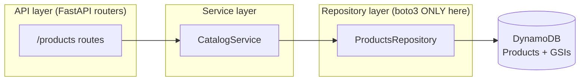
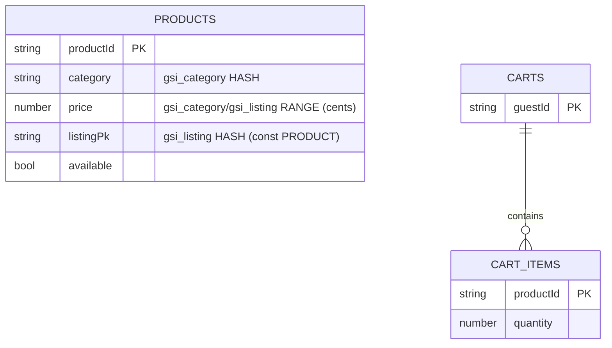
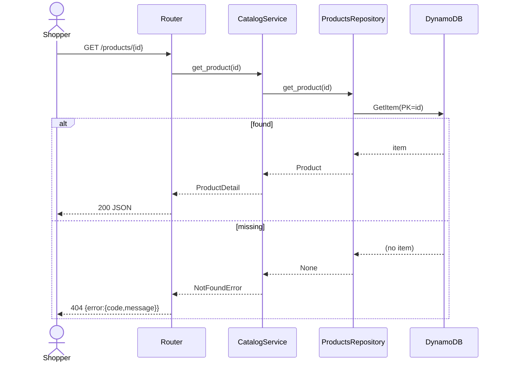
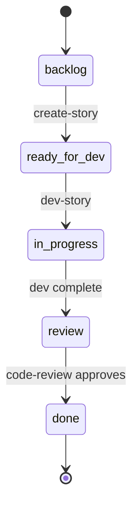
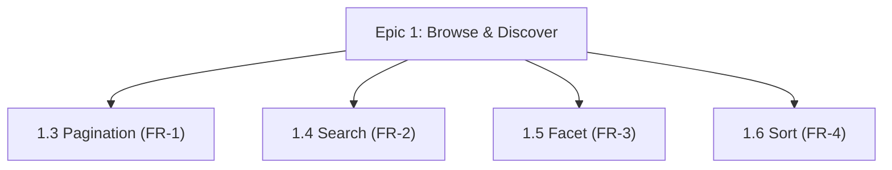
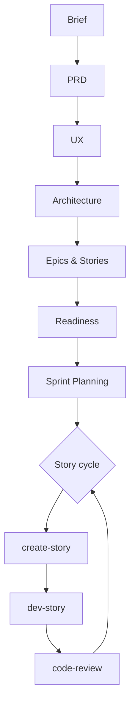

# Mermaid Patterns — catalog, templates, and lint rules

The `bmad-mermaid-diagrams` skill reads this file before generating. Each entry: **when to use**,
a **canonical template**, and notes. Emit diagrams as fenced ```mermaid blocks. Below the catalog is
a single **lint checklist** applied to every generated block.

---

## 1. Component / layer view — `flowchart`

**When:** an architecture with layers/components and directed dependencies (e.g. ports-and-adapters:
`api → services → repositories → datastore`; the rule "boto3 only in repositories").



Notes: use `subgraph` for layers; `[( )]` cylinder for datastores; `<br/>` for line breaks inside
labels. Direction `LR` (left-right) for layered flows, `TD` (top-down) for hierarchies.

## 2. Data model — `erDiagram`

**When:** entities/tables with attributes, keys, and relationships (DynamoDB tables + GSIs, or
relational schemas).



Notes: cardinality tokens — `||` exactly one, `o{` zero-or-many, `|{` one-or-many; combine as
`||--o{`. Put key/index hints in the quoted comment column. For a single DynamoDB table, one entity
block with `PK` + index annotations is clearer than forcing relations.

## 3. Request flow — `sequenceDiagram`

**When:** showing how one request traverses the layers (an endpoint's happy path and/or error path).



Notes: `->>` solid call, `-->>` dashed return; `alt/else/end` for branches; `actor` for humans.

## 4. Status lifecycle — `stateDiagram-v2`

**When:** a lifecycle/state machine (story or epic status; order state).



Notes: `[*]` is start/end; transition labels after `:`. Use underscores in state ids (avoid hyphens
that Mermaid may misparse); put the human label in the transition text.

## 5. Hierarchy / coverage / dependency — `flowchart TD`

**When:** epics→stories→FRs coverage, or module/task dependencies.



## 6. Process flow — `flowchart TD`

**When:** the BMAD phase/skill lifecycle or any process.



---

## Lint checklist (apply to EVERY generated block)

1. **Kind header** is present and valid on the first line: one of `flowchart`/`graph`,
   `erDiagram`, `sequenceDiagram`, `classDiagram`, `stateDiagram-v2`, `gantt`.
2. **Labels with spaces/punctuation/parentheses/braces are quoted**: `A["GET /x (v1)"]`, not
   `A[GET /x (v1)]`. Unquoted `()`/`{}`/`,`/`:` inside labels are the #1 parse failure.
3. **Node ids are safe**: alphanumeric/underscore, no spaces, not reserved words (`end`, `class`,
   `state`, `subgraph`, `graph`). Lowercase `end` as a bare id breaks flowcharts — rename to `end_`.
4. **Brackets balanced**: every `[`,`(`,`{`,`subgraph` has its close (`]`,`)`,`}`,`end`).
5. **Arrows match the kind**: flowchart `-->`/`---`/`-.->`; sequence `->>`/`-->>`; ER `||--o{` etc.
   Don't mix a sequence arrow into a flowchart.
6. **erDiagram**: cardinality on both sides (`||`,`o{`,`|{`,`}o`,`}|`); attribute lines are
   `type name` (+ optional `PK`/`FK` + optional quoted comment).
7. **stateDiagram-v2**: uses `[*]` for start/end; state ids have no hyphens.
8. **sequenceDiagram**: every `participant`/`actor` referenced by an arrow is declared; `alt/opt/loop`
   are closed with `end`.
9. **Readability**: prefer &lt;= ~20 nodes; split otherwise. Provide a heading + one-line caption
   above each block.
10. **Fencing**: exactly one ```mermaid block per diagram; nothing else inside the fence.
