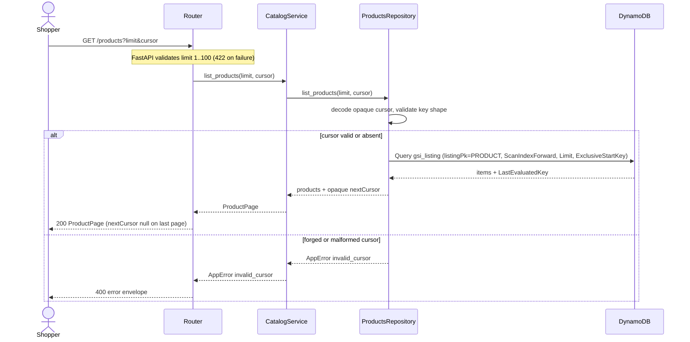

# API Contracts — bmad-ecommerce (part: backend)

**Generated:** 2026-07-06 · Source of truth: FastAPI OpenAPI at `/openapi.json` (`/docs` for Swagger UI)

Conventions: JSON is **camelCase**; money is **integer minor units (cents)**; errors use the
envelope `{"error": {"code", "message"}}`; pagination uses an **opaque base64 cursor**.

## GET /health

Liveness probe. No dependencies.

- **200** → `{ "status": "ok" }`

## GET /health/deep

Readiness probe — proves DynamoDB connectivity via `list_tables()` (no table disclosure).

- **200** → `{ "status": "ok", "dynamodb": "reachable", "tableCount": <int> }`
- **503** → `{ "error": { "code": "dynamodb_unreachable", "message": "DynamoDB not reachable" } }`

## GET /products

Paginated catalog listing, ordered by price ascending (via `gsi_listing`). Realizes FR-1.

**Query parameters**

| Name | Type | Default | Constraints |
|------|------|---------|-------------|
| `limit` | int | 24 | `ge=1, le=100` |
| `cursor` | string | — | opaque token from a prior response; `max_length=2048` |

**200** → `ProductPage`:
```json
{
  "items": [
    {
      "productId": "p-0001",
      "name": "Classic Tee 1",
      "price": 637,
      "imageUrl": "https://picsum.photos/seed/p-0001/400/400",
      "category": "apparel",
      "available": true
    }
  ],
  "nextCursor": "eyJwcm9kdWN0SWQiOnsiUyI6..."
}
```
- `nextCursor` is `null` on the last page.
- Follow pagination by passing `?cursor=<nextCursor>`.

**Errors**
- **422** invalid `limit` (out of 1–100) → `{ "error": { "code": "validation_error", "message": "Request validation failed" } }`
- **400** malformed/forged cursor → `{ "error": { "code": "invalid_cursor", "message": "Invalid pagination cursor" } }`

**Example**
```bash
curl 'http://localhost:8000/products?limit=5'
curl 'http://localhost:8000/products?limit=5&cursor=<nextCursor>'
```

## Planned (later Epic 1 stories, not yet implemented)

- `GET /products?search=<kw>` — keyword search (FR-2, Story 1.4)
- `GET /products?category=<c>` — category facet (FR-3, Story 1.5)
- `GET /products?sort=<price_asc|price_desc>` — sort control (FR-4, Story 1.6)
- `GET /products/{productId}` — product detail / PDP (FR-5, Epic 2)

> These will extend the same `/products` contract and `CatalogService`. Note (from review):
> once filters are added, pagination must loop-to-fill because DynamoDB applies `Limit`
> before a `FilterExpression`.

## Diagrams

Request flow for the paginated listing through the ports-and-adapters layers, including the
`invalid_cursor` branch. Source: this contract + [architecture-backend.md](./architecture-backend.md).
Generated by `bmad-mermaid-diagrams`.

<!-- BMAD-MERMAID:START id=get-products-sequence -->

<!-- BMAD-MERMAID:END id=get-products-sequence -->

