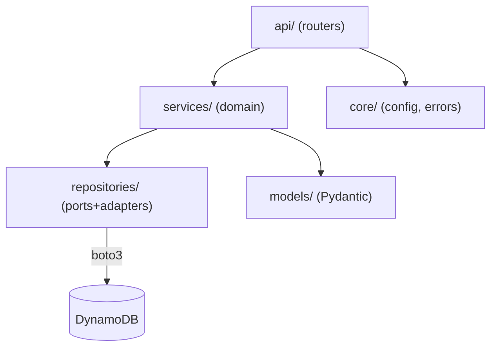

# Backend Architecture — bmad-ecommerce (part: backend)

**Generated:** 2026-07-06 · FastAPI on DynamoDB

## Executive summary

A stateless Python/FastAPI service exposing a REST/JSON API over DynamoDB, organized
as **ports-and-adapters (hexagonal-lite)**. Requests flow `api → services → repositories`;
DynamoDB access (boto3) is confined to the repository layer. Configuration is 12-factor;
the only local↔AWS difference is the DynamoDB endpoint. OpenAPI is the contract source of truth.

## Technology stack

| Category | Technology | Version | Notes |
|----------|-----------|---------|-------|
| Language | Python | 3.13 | `python:3.13-slim` base image |
| Framework | FastAPI | 0.139.x | auto OpenAPI at `/docs`, `/openapi.json` |
| Server | Uvicorn | current | `uvicorn app.main:app` |
| Validation | Pydantic v2 + pydantic-settings | v2 | `CamelModel` base for camelCase JSON |
| AWS SDK | boto3 | current | DynamoDB client with endpoint override + timeouts |
| Tests | pytest + moto[dynamodb] | 8 / 5 | mocked DynamoDB, FastAPI TestClient |

## Architecture pattern — layers & dependency rule

- **api/** — FastAPI routers; translate HTTP ↔ service calls. No business logic, no boto3.
- **services/** — domain logic (`CatalogService`); depends on repositories; maps domain → response models.
- **repositories/** — the only layer importing boto3. `ProductsRepository` owns the Products table; `dynamodb.py` is the shared client factory.
- **models/** — `Product` (domain), `ProductSummary`/`ProductPage` (API); all extend `CamelModel`.
- **core/** — `Settings` (12-factor config) and the error envelope + handlers.

## Key invariants (from the architecture spine)

| AD | Rule |
|----|------|
| AD-1 | Dependency flow `api → services → repositories`; boto3 only in `repositories/` |
| AD-3 | One aggregate ⇒ one table ⇒ one repository (Products/Carts/Orders) |
| AD-4 | Catalog served via GSIs: `gsi_category` (category/price), `gsi_listing` (constant/price); opaque cursor pagination |
| AD-5 | OpenAPI is source of truth; camelCase JSON; `{error:{code,message}}` envelope |
| AD-6 | Money as integer minor units (cents); no floats server-side |
| AD-8 | 12-factor config; only local↔AWS diff is `DYNAMODB_ENDPOINT` (+ creds) |
| AD-9 | Stateless API; all mutable state in DynamoDB |

## Configuration (`app/core/config.py`)

`Settings` (pydantic-settings, cached via `get_settings()`) reads env vars:
`DYNAMODB_ENDPOINT`, `AWS_REGION`, `AWS_ACCESS_KEY_ID`/`AWS_SECRET_ACCESS_KEY`,
`PRODUCTS_TABLE`/`CARTS_TABLE`/`ORDERS_TABLE`, `FLAT_SHIPPING` (cents), `CORS_ORIGINS`.
The boto3 client (`repositories/dynamodb.py`) injects `endpoint_url` + static creds only
when `DYNAMODB_ENDPOINT` is set (local); on AWS it uses the default credential chain.

## Error handling (`app/core/errors.py`)

`AppError` (base) → mapped to `{error:{code,message}}`. Handlers also wrap FastAPI's
`HTTPException` (e.g. 404 → `not_found`) and `RequestValidationError` (422 → `validation_error`),
and a catch-all 500 that never leaks internals. Example domain error: `invalid_cursor` (400).

## API surface (current)

| Method | Path | Purpose |
|--------|------|---------|
| GET | `/health` | liveness |
| GET | `/health/deep` | readiness — DynamoDB `list_tables()` reachability + table count |
| GET | `/products` | paginated catalog listing (limit, opaque cursor) |

Full contract: [api-contracts-backend.md](./api-contracts-backend.md).

## Data architecture

DynamoDB, one table per aggregate. Implemented: **Products** (PK `productId`) with GSIs
`gsi_category` and `gsi_listing`. Details + planned Carts/Orders: [data-models-backend.md](./data-models-backend.md).

## Testing strategy

`pytest` with `moto`'s `mock_aws` for DynamoDB-backed units (repository/seed) and FastAPI
`TestClient` for endpoints (using `dependency_overrides`). 28 tests as of this scan. Run:
`cd backend && .venv/Scripts/python -m pytest -q`.

## Deployment

Local-first via Docker Compose (`amazon/dynamodb-local`). Container is 12-factor, so AWS
ECS/Fargate is an additive change (endpoint + IAM). See [deployment-guide.md](./deployment-guide.md).
