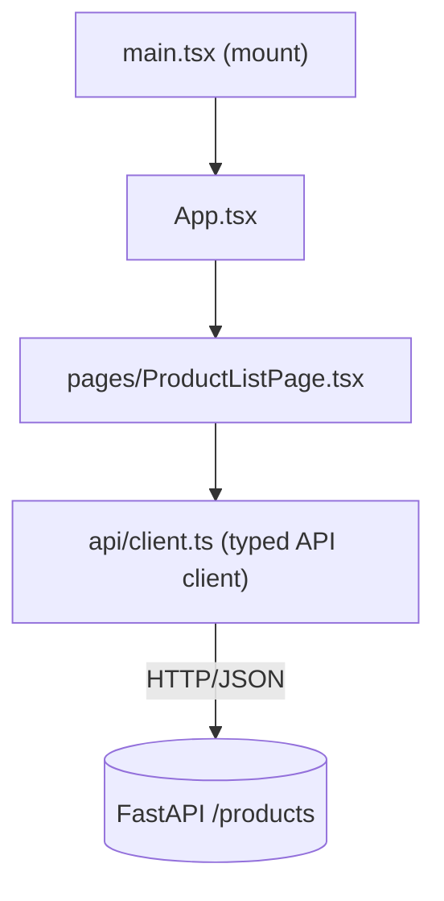

# Frontend Architecture — bmad-ecommerce (part: frontend)

**Generated:** 2026-07-06 · React 19 / TypeScript / Vite 8

## Executive summary

A React/TypeScript single-page app (Vite) that consumes the backend REST API through a
**single typed API-client module**. Components never call `fetch` directly. Pages live under
`src/pages/`; the storefront home currently renders the Product Listing Page (PLP).

## Technology stack

| Category | Technology | Version | Notes |
|----------|-----------|---------|-------|
| UI library | React | 19.2 | function components + hooks |
| Language | TypeScript | 5.x | strict mode |
| Build/dev | Vite | 8.1 | dev server on :5173, `@vitejs/plugin-react` |
| Runtime | Node.js | 22 LTS | `node:22` image |
| Tests | Vitest | ready (not yet used) | — |

## Structure & pattern



- **`src/api/client.ts`** — the sole network boundary (AD-5). Reads `VITE_API_BASE_URL`
  (falls back to `http://localhost:8000`), wraps `fetch` with an `AbortController` timeout,
  and exposes typed calls: `getHealth()`, `listProducts({limit, cursor})`, plus `formatPrice(cents)`
  — the only place integer cents becomes a display string (AD-6).
- **`src/pages/ProductListPage.tsx`** — PLP: fetches page 1 on mount, renders a responsive
  card grid (image, name, price, link to `/products/:productId`), and a "Load more" button
  that appends the next page via the opaque `nextCursor`; handles loading/error/empty states.
- **`src/App.tsx`** — renders the PLP as home. (A router arrives with the PDP route in Epic 2.)
- **`src/state/`** — placeholder for cart + guest-token state (Epic 3).

## Types (mirror the API contract)

```ts
interface ProductSummary { productId; name; price /* cents */; imageUrl; category; available }
interface ProductPage    { items: ProductSummary[]; nextCursor: string | null }
```

## Conventions

- camelCase throughout (matches the API's camelCase JSON).
- No direct `fetch` in components — always via `client.ts`.
- Money handled as integer cents; formatted only at render (`formatPrice`).
- Env config through Vite `import.meta.env.VITE_*`.

## Build & run

- Dev: `npm run dev` (Vite, `--host 0.0.0.0`, port 5173).
- Build: `npm run build` (`tsc -b && vite build`).
- Container: `frontend/Dockerfile` (node:22, `npm ci`, runs the dev server). See [development-guide.md](./development-guide.md).

## Integration

Consumes the backend at `VITE_API_BASE_URL`. CORS is configured on the API for the frontend
origin. Details: [integration-architecture.md](./integration-architecture.md).
