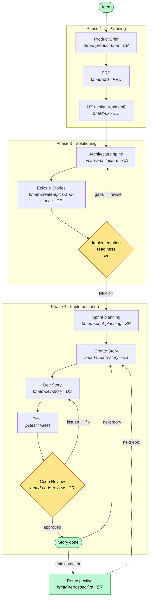

# BMAD Lifecycle

The phase-based flow this project follows, from planning through the per-story build cycle.
Each node names the **BMAD skill** (menu code) that drives it.

## The spine in words

| Step | Skill | Produces |
|------|-------|----------|
| **Planning** | `bmad-product-brief` → `bmad-prd` (+ optional `bmad-ux`) | brief → PRD (FRs/NFRs) |
| **Architecture** | `bmad-architecture` | the invariant "spine" (ADs) all code obeys |
| **Story** | `bmad-create-epics-and-stories` → `bmad-create-story` | epics → context-rich story files |
| **Dev** | `bmad-dev-story` | working code (red → green → refactor) |
| **Test** | pytest / vitest (inside dev-story) | passing unit/integration tests |
| **Review** | `bmad-code-review` | adversarial findings → patch / defer / dismiss |

## Key loops

- **Story cycle** — `Create Story → Dev → Test → Review` repeats once per story; Review sends work back to Dev on issues, or forward to *done*, then pulls the next story.
- **Readiness gate** — before any code, `IR` confirms PRD ↔ Architecture ↔ Stories align; gaps loop back to revise the plan.
- **Per-epic retrospective** — optional at each epic's end, feeding lessons into the next epic.

> Status of each story is tracked in `_bmad-output/implementation-artifacts/sprint-status.yaml`
> (`backlog → ready-for-dev → in-progress → review → done`).

---

## Skill reference — name · what it does · input · output

Every node in the diagram is a Claude Code skill (installed under `.claude/skills/`). Invoke by name (e.g. *"Run bmad-prd"*) or by the menu code.

### Phase 1–2 · Planning

| Skill (code) | What it does | Input | Output |
|--------------|--------------|-------|--------|
| **bmad-help** (BH) | Analyzes current project state and recommends the next skill(s) to run | Your question + the artifacts present | Guidance only (no file) |
| **bmad-product-brief** (CB) | Coaches you to a concise product brief — the vision, problem, users, scope | An idea / conversation; optional source docs | `planning-artifacts/briefs/…/brief.md` (+ `.memlog.md`) |
| **bmad-prd** (PRD) | Turns the brief into a Product Requirements Document — functional requirements (FRs), NFRs, scope, non-goals | `brief.md` + your answers | `planning-artifacts/prds/…/prd.md` |
| **bmad-ux** (CU) *(optional)* | Produces a UX design contract (IA, flows, components, states, a11y) | PRD | `planning-artifacts/ux-designs/…/DESIGN.md` + `EXPERIENCE.md` |

### Phase 3 · Solutioning

| Skill (code) | What it does | Input | Output |
|--------------|--------------|-------|--------|
| **bmad-architecture** (CA) | Produces the architecture "spine" — the invariant decisions (ADs) all code must obey; verifies tech/versions | PRD (+ UX if present) | `planning-artifacts/architecture/…/ARCHITECTURE-SPINE.md` |
| **bmad-create-epics-and-stories** (CE) | Decomposes requirements into user-value epics and implementable stories with acceptance criteria | PRD + Architecture (+ UX) | `planning-artifacts/epics.md` (epics, stories, FR-coverage map) |
| **bmad-check-implementation-readiness** (IR) | Cross-checks PRD ↔ Architecture ↔ Epics/Stories for gaps before coding | PRD, Architecture, epics.md | `planning-artifacts/implementation-readiness-report-*.md` (READY / NEEDS-WORK verdict) |

### Phase 4 · Implementation

| Skill (code) | What it does | Input | Output |
|--------------|--------------|-------|--------|
| **bmad-sprint-planning** (SP) | Builds the sprint tracker from the epics (one entry per story + retrospectives) | `epics.md` | `implementation-artifacts/sprint-status.yaml` |
| **bmad-sprint-status** (SS) | Summarizes progress and surfaces risks; routes to the next step | `sprint-status.yaml` | Status summary (no file) |
| **bmad-create-story** (CS) | Writes a context-rich story file (tasks, ACs, ADs, prior-story learnings) — the dev agent's brief | epics.md, PRD, Architecture, prior story, sprint-status | `implementation-artifacts/<story-key>.md`; status → `ready-for-dev` |
| **bmad-create-story** *(validate)* (VS) | Independent quality check of a drafted story before dev | A story file | Validation report / edits to the story |
| **bmad-dev-story** (DS) | Implements the story task-by-task (red→green→refactor); writes real code + tests | The story file + Architecture + existing code | Code under `backend/`/`frontend/`; story updated; status `in-progress → review` |
| **bmad-code-review** (CR) | 3 parallel adversarial layers (Blind Hunter, Edge Case Hunter, Acceptance Auditor) + triage | Diff since `baseline_commit` + story (spec) + Architecture | `### Review Findings` in the story file + `deferred-work.md`; patches applied on request |
| **bmad-retrospective** (ER) *(optional)* | Post-epic review to extract lessons and action items | Completed epic's stories | `implementation-artifacts/…` retrospective notes |

### Supporting skills (anytime)

| Skill (code) | What it does | Input | Output |
|--------------|--------------|-------|--------|
| **bmad-correct-course** (CC) | Handles a significant mid-flight change; may recommend revising PRD/architecture/stories | The change signal + current artifacts | Change proposal |
| **bmad-shard-doc** (SD) | Splits a large markdown doc into per-section files | A doc > ~500 lines | Sharded folder + `index.md` |
| **bmad-document-project** (DP) | Generates docs for an existing/brownfield codebase | The codebase | Project documentation |
| **bmad-quick-dev** (QQ) | Intent-in → code-out for a small standalone change (skips the full story cycle) | A request | Code + a lightweight spec |

*Menu codes match the "Skills used per phase / task" table in [command-log.md](command-log.md). All planning/implementation outputs live under `_bmad-output/` (tracked in git; only the `_bmad/` engine + `.claude/` are gitignored).*
