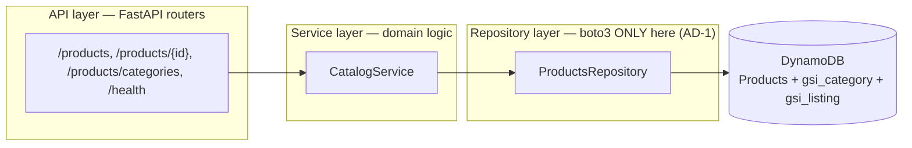
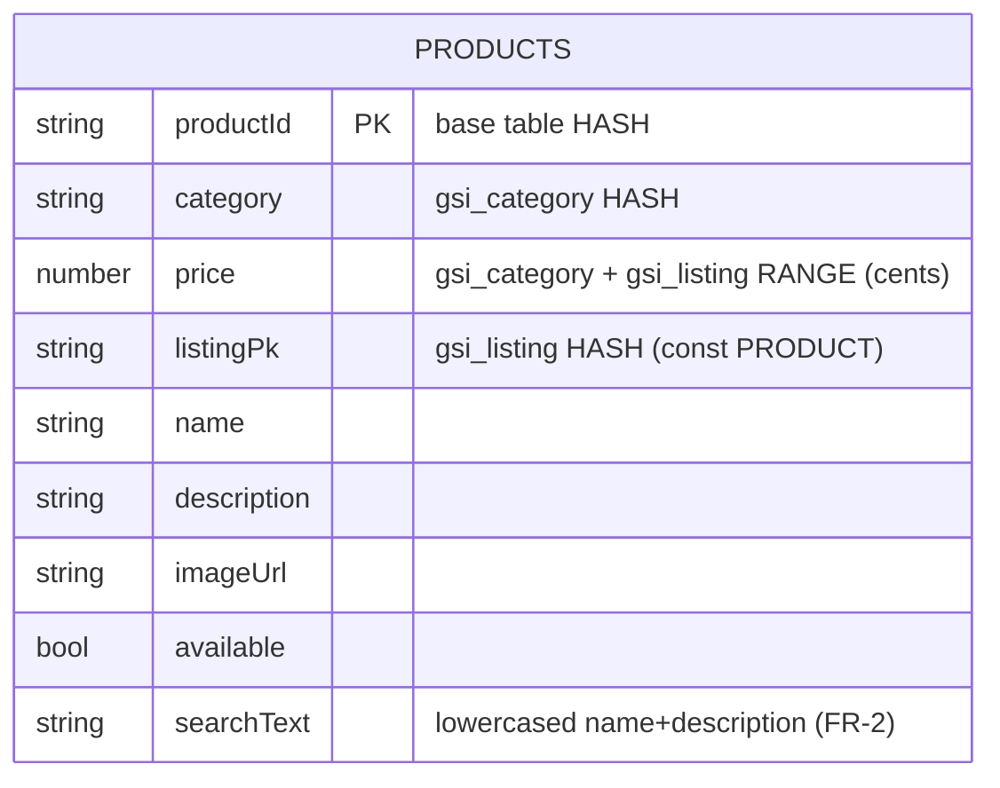
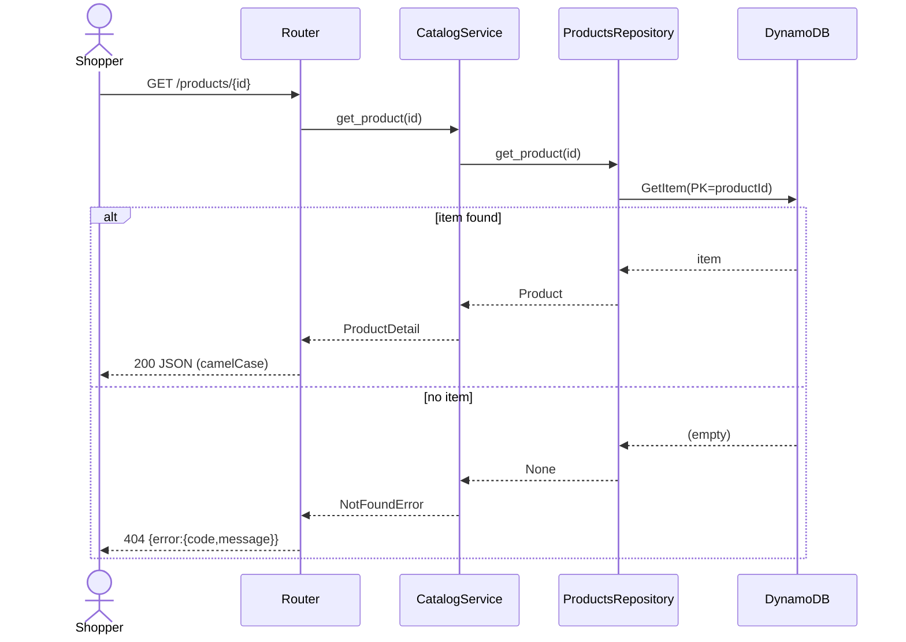
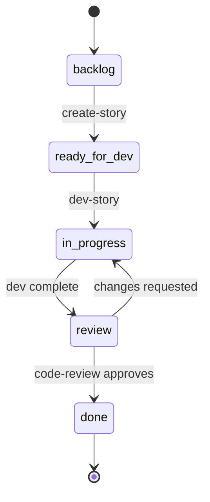
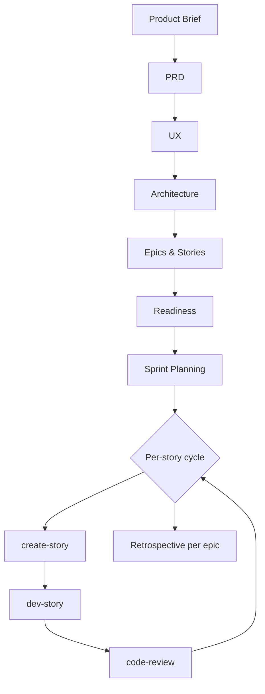

# Architecture & Process Diagrams

Mermaid diagrams generated by the [`bmad-mermaid-diagrams`](bmad/mermaid-diagrams-skill.md) skill
from this project's docs and planning artifacts. Rendered natively by GitHub / VS Code / most
Markdown viewers. Each block sits in a `BMAD-MERMAID` region so re-running the skill updates it in
place. Sources are cited per diagram; diagrams reflect only what those sources state.

## Index

- [Backend component & layer view](#backend-component--layer-view)
- [Products data model](#products-data-model)
- [PDP request flow (GET /products/{id})](#pdp-request-flow)
- [Story status lifecycle](#story-status-lifecycle)
- [BMAD phase lifecycle](#bmad-phase-lifecycle)

## Backend component & layer view

Ports-and-adapters layering (AD-1): requests flow `api → services → repositories → DynamoDB`, and
**boto3 lives only in the repository layer**. Source: `ARCHITECTURE-SPINE.md`, `backend/app/`.

<!-- BMAD-MERMAID:START id=backend-layers -->

<!-- BMAD-MERMAID:END id=backend-layers -->

## Products data model

The only aggregate implemented so far (AD-3: one table per aggregate). Keys/indexes per AD-4; money
in integer cents (AD-6). Carts and Orders are planned for Epics 3–4 and are intentionally not drawn
until they exist. Source: `data-models-backend.md`, `backend/app/repositories/products.py`.

<!-- BMAD-MERMAID:START id=products-erd -->

<!-- BMAD-MERMAID:END id=products-erd -->

## PDP request flow

`GET /products/{id}` (Story 2.1): the happy path and the not-found path, through the layers.
Source: `2-1-view-product-detail.md`, `backend/app/`.

<!-- BMAD-MERMAID:START id=pdp-sequence -->

<!-- BMAD-MERMAID:END id=pdp-sequence -->

## Story status lifecycle

The sprint-tracked status a story moves through. Source: `sprint-status.yaml` (STATUS DEFINITIONS).

<!-- BMAD-MERMAID:START id=story-lifecycle -->

<!-- BMAD-MERMAID:END id=story-lifecycle -->

## BMAD phase lifecycle

The end-to-end BMAD flow used on this project. Source: `docs/bmad/lifecycle.md`, `command-log.md`.

<!-- BMAD-MERMAID:START id=bmad-lifecycle -->

<!-- BMAD-MERMAID:END id=bmad-lifecycle -->
