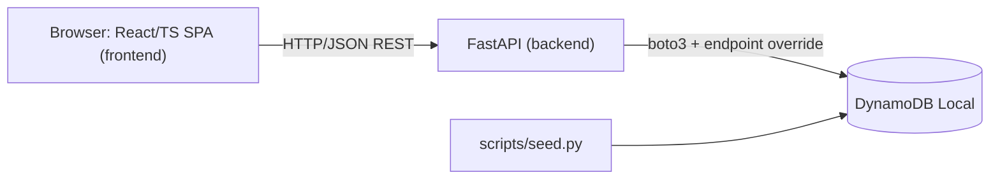

# Integration Architecture — bmad-ecommerce

**Generated:** 2026-07-06 · Multi-part monorepo (frontend ↔ backend ↔ DynamoDB)

## Parts & how they communicate

## Integration points

| From | To | Type | Details |
|------|----|------|---------|
| frontend | backend | REST / JSON over HTTP | Single client `frontend/src/api/client.ts`; base URL from `VITE_API_BASE_URL` (default `http://localhost:8000`). Calls: `GET /health`, `GET /products`. |
| backend | DynamoDB | AWS SDK (boto3) | Only via `backend/app/repositories/`; endpoint `http://dynamodb-local:8000` in-network (`localhost:8001` from host). |
| seed | DynamoDB | AWS SDK (boto3) | `python -m scripts.seed` provisions the table + loads the catalog. |

## Contract & conventions across the boundary

- **Protocol:** REST/JSON. FastAPI's OpenAPI (`/openapi.json`) is the authoritative contract; the frontend's TS types mirror it.
- **Casing:** camelCase on the wire (backend `CamelModel`; frontend interfaces match).
- **Money:** integer minor units (cents) across the boundary; the frontend formats to a display string (`formatPrice`).
- **Errors:** uniform `{ "error": { "code", "message" } }` envelope; the frontend surfaces failures generically (envelope-aware handling is a deferred enhancement).
- **Pagination:** opaque base64 cursor passed back as `?cursor=`; frontend treats an empty page / null cursor as the end.
- **CORS:** the API allows the frontend origin via `CORS_ORIGINS`.

## Ports (local)

| Service | Host | In-network |
|---------|------|-----------|
| API | `localhost:8000` | `api:8000` |
| Frontend (Vite) | `localhost:5173` | `frontend:5173` |
| DynamoDB Local | `localhost:8001` | `dynamodb-local:8000` |

## Data flow — browse the catalog (Story 1.3)

1. Browser loads the SPA (`:5173`); `ProductListPage` mounts.
2. `client.listProducts({limit:24})` → `GET /products?limit=24` on the API.
3. Router → `CatalogService.list_products` → `ProductsRepository.list_products` queries `gsi_listing` (price ascending) with `ExclusiveStartKey` from the decoded cursor.
4. API returns `{ items, nextCursor }` (camelCase); the grid renders and "Load more" pages via `nextCursor`.

## Anonymous identity (planned, Epic 3)

An opaque **guest token** (`X-Guest-Token`) will tie carts/orders to a browser session — no auth.
Not yet part of the integration surface.
